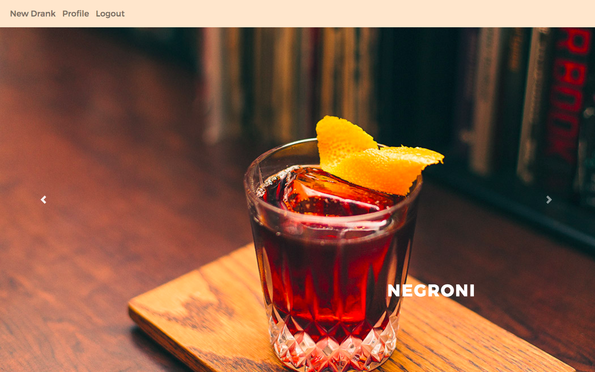

# GA WDI London: Project 2

## last.drank

### User Journey

A user driven app that helps people find recommendations for cocktails that match their preferences. Users know that they enjoy a particular classic cocktail and would like to try something new and different, but still to their taste.

Navigating to the home page for that particular cocktail they will find recommendations posted by fellow users that are 'twists' on these classic cocktails.

")
")

We can create our own twists and post them for other people to enjoy, making sure to record the change in ingredients so other users can purchase these products to make it themselves at home or request it when out.

")

These twists can be commented on and recommended for anyone who tried it.

### Build & Technologies Used

- This app is built with an [Express](https://github.com/expressjs/express) back-end, written using Node.js, that uses EJS to render views.

- [MongoDB](https://docs.mongodb.com) was used to store the data and [Mongoose](http://mongoosejs.com) to create models within express.

- Images are base64 encoded and stored using the [AWS S3 service](https://aws.amazon.com/s3).

- [Express Sessions](https://www.npmjs.com/package/express-sessions) is used to provide authentication, [bcrypt](https://www.npmjs.com/package/bcrypt) for password hashing and oAuth authorisation via Facebook and Github.

- Styles are written in [SASS](http://sass-lang.com/documentation/file.SASS_REFERENCE.html) and [Gulp](https://github.com/gulpjs/gulp/blob/master/docs/API.md) is used as a taskrunner.

- I used [Babel](https://babeljs.io) to compile to ES5.

- The [Tesco API](https://devportal.tescolabs.com/) is used to provide information on the ingredients to each cocktail or twist.

* The app is deployed via Heroku. [Try it here.](https://last-drank.herokuapp.com/)

### Challenges

The main problem I encountered was normalising the recommendations’ or “twists”’ main ingredient of new entries. I did this using the Tesco API, which makes a request based on the user’s input. The vast data response from the API needed thorough filtering and the necessary attributes of the product passed through to the database using hidden inputs.
